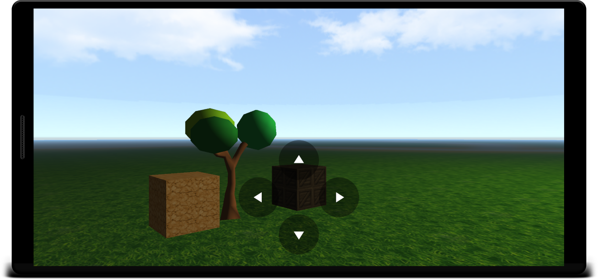

# Siage3D



**Siage3D** stands for **SI**mple **A**ndroid **G**ame **E**ngine.

So it's a game engine that is:

* **Easy** to use
* **Lightweight**
* Dedicated to **Android**
* Coded in **Kotlin** using OpenGL ES

_Please note that this engine is a **work in progress**. Though feedback is always welcome, it is neither feature-complete nor production ready yet (and it might never be)._

## Getting started

### Setup

In your `build.gradle`, add the following dependency:

```groovy
implementation "org.mrlem.siage3d:core:1.0.0"
```

(once it gets published, until then: use the source :)

### Usage

Create an activity for your game:

```Kotlin
class SimpleActivity : SceneActivity() {

    override val sceneAdapter = SimpleSceneAdapter()

}
```

Declare it in your manifest:

```xml
        <activity android:name=".SimpleActivity">
            <intent-filter>
                <action android:name="android.intent.action.MAIN" />
                <category android:name="android.intent.category.LAUNCHER" />
            </intent-filter>
        </activity>
```

Create the scene adapter, that's where you can describe & manipulate the scene:

```kotlin
class SimpleSceneAdapter : SceneAdapter() {

    override fun onCreateScene() = scene {
        camera {
            position(0f, 1.75f, 5f)
        }

        sky {
            color(.6f, .8f, 1f)
        }

        directionLight("sun") {
            diffuse(1f, 1f, 1f)
            rotation(0f, 60f, 0f)
        }

        objectNode("my-cube", Box()) {
            textureMaterial(R.drawable.crate1_diffuse, 1f, reflectivity = 0.1f)
            position(0f, 1.5f, -2f)
        }
    }

}
```

And voilà!

Want to know more? checkout the slightly more [advanced sample](sample/src/main/java/org/mrlem/siage3d/sample/AdvancedSceneAdapter.kt)!

## Features

* Scene definition
  - scene-graph API
  - kotlin DSL
  - height-maps
* Object loading
  - OBJ files (partial)
* Rendering
  - Skybox
  - Distance fog
  - Lighting: directional light, up to 3 point-lights
  - Multi-texturing

## About

### Author

* *Sébastien Guillemin*

### License

GPLv3 see [LICENSE.md](LICENSE.md)

### Acknowlegments

Built with:

* [JOML](https://github.com/JOML-CI/JOML): Java OpenGL Math Library

Special thanks to:

* [ThinMatrix](https://www.youtube.com/user/ThinMatrix): awesome video tutorials on game programming
* [Learn OpenGL](https://learnopengl.com): excellent articles on OpenGL
