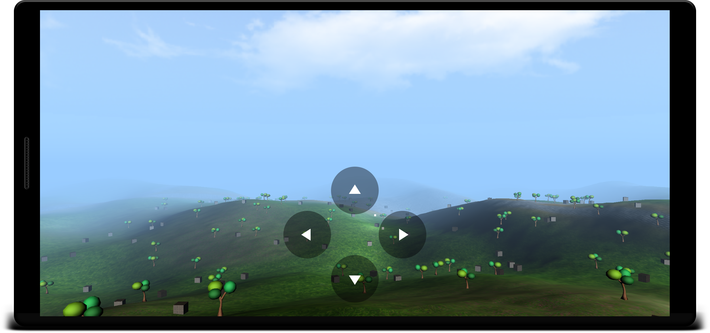

# Siage3D
 [](https://www.gnu.org/licenses/gpl-3.0) 

**Siage3D** stands for **SI**mple **A**ndroid **G**ame **E**ngine.



So it's a game engine that is:

* **Easy** to use
* **Lightweight**
* Dedicated to **Android**
* Coded in **Kotlin** using OpenGL ES

_Please note that this engine is a **work in progress**. Though feedback is always welcome, it is neither
feature-complete nor production ready yet (and it might never be)._

## Getting started

### Setup

In your `build.gradle`, add the following repository (if not already present):

```groovy
repositories {
    mavenCentral()
}
```

And add the following dependency:

```groovy
implementation "org.mrlem.siage3d:siage3d-core:0.2.0"
```

### Usage

Create an activity for your game:

```Kotlin
class Game : SceneActivity() {

    override fun createSceneAdapter() = SceneAdapter(initialScene)

}
```

Declare it in your manifest:

```xml
        <activity android:name=".Game">
            <intent-filter>
                <action android:name="android.intent.action.MAIN" />
                <category android:name="android.intent.category.LAUNCHER" />
            </intent-filter>
        </activity>
```

Create the scene:
```kotlin
val initialScene = scene {
    camera {
        position(0f, 1.75f, 5f)
    }

    sky {
        color(.6f, .8f, 1f)
    }

    directionLight("sun") {
        diffuse(1f, 1f, 1f)
        rotation(0f, 60f, 0f)
    }

    objectNode("my-cube", BoxShape()) {
        material { texture(R.drawable.crate1_diffuse) }
        position(0f, 1f, -2f)
    }
}
```

Create the behaviour for our cube:
```kotlin
class RotatingBehaviour : Behaviour() {

    private val spatialNode get() = node as? SpatialNode
    private var time = 0f

    override fun update(delta: Float) {
        time += delta
        spatialNode?.rotate(0f, time * 50f, 0f)
    }

}
```

And finally: create the scene adapter, that's where you bind the scene to the view, and where we will assign the cube
its behaviour in this simple example:

```kotlin
class SceneAdapter(scene: Scene) : SceneAdapter(scene) {

    private val cube = scene.get<ObjectNode>("my-cube")!!

    init {
        cube.add(RotatingBehaviour())
    }

}
```

And voilà!

Want to know more? checkout the slightly more
[advanced sample](sample/src/main/java/org/mrlem/siage3d/sample/advanced/SceneAdapter.kt)!

## Features

* Scene definition
  - scene-graph API
  - kotlin DSL
  - height-maps
* Object loading
  - OBJ files (partial)
* Rendering
  - Skybox
  - Distance fog
  - Lighting: directional light, up to 3 point-lights
  - Multi-texturing

## About

### Author

* *Sébastien Guillemin*

### License

GPLv3 see [LICENSE.md](LICENSE.md)

### Acknowlegments

Built with:

* [JOML](https://github.com/JOML-CI/JOML): Java OpenGL Math Library

Special thanks to:

* [ThinMatrix](https://www.youtube.com/user/ThinMatrix): awesome video tutorials on game programming
* [Learn OpenGL](https://learnopengl.com): excellent articles on OpenGL
